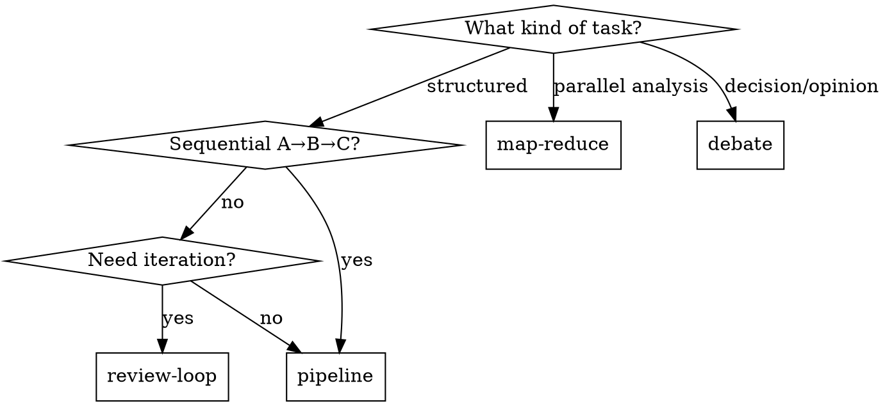

# AGW Combo — Multi-Agent Collaboration

Run multi-agent collaboration patterns via AGW (Agent Gateway). AGW orchestrates Claude, Codex, and Gemini CLI agents in structured workflows.

## Prerequisites

AGW daemon must be running: `agw daemon start`

## 4 Combo Patterns

| Pattern | Use When | Flow |
|---------|----------|------|
| **pipeline** | Sequential processing with data flow | A → B → C (each feeds next) |
| **map-reduce** | Parallel independent analysis + synthesis | [A, B] ∥ → C synthesizes |
| **review-loop** | Iterative implementation + review | impl ↔ review until APPROVED |
| **debate** | Multiple perspectives on a decision | argue → counter → judge |

## Built-in Presets

```bash
agw combo presets                    # List all presets
agw combo preset analyze-implement-review "fix login bug"
agw combo preset multi-perspective "should we use Redis or SQLite?"
agw combo preset code-review-loop "implement auth middleware"
agw combo preset debate "monorepo vs polyrepo for our stack"
```

## Custom Combo

```bash
agw combo run '{
  "name": "my-combo",
  "pattern": "map-reduce",
  "input": "Analyze our API security",
  "steps": [
    {"agent": "claude", "role": "security-analyst", "prompt": "Analyze security: {{input}}"},
    {"agent": "codex", "role": "pen-tester", "prompt": "Find vulnerabilities: {{input}}"},
    {"agent": "claude", "role": "synthesizer", "prompt": "Combine findings:\n{{all}}"}
  ]
}'
```

## Template Variables

| Variable | Description |
|----------|-------------|
| `{{input}}` | Original combo input |
| `{{prev}}` | Previous step's output |
| `{{step.N}}` | Output of step N (0-indexed) |
| `{{all}}` | All step results concatenated |

## Check Status

```bash
agw combo status <comboId>
agw combo list
```

## HTTP API

```
POST /combos              — start custom combo
POST /combos/preset/:id   — start preset
GET  /combos/presets       — list presets
GET  /combos/:id           — get status + results
```

## Quick Decision Guide


